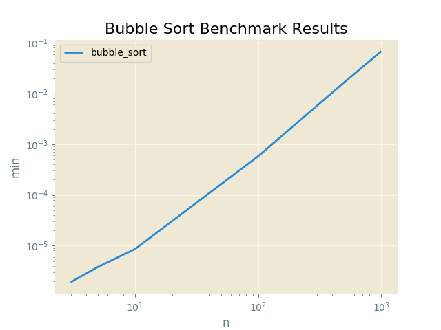

#Bubble Sort Benchmark Results

Proofs
------

|  Input               |  Output              |  Script       |  User     |
|----------------------|----------------------|---------------|-----------|
|  [6, 3, 1, 2, 5, 4]  |  [1, 2, 3, 4, 5, 6]  |  bubble_sort  |  sarcoma  |

Plots
-----

Bubble Sort Benchmark Results
----------

N = 3
------

|  min          |  avg          |  max          |  func         |  name     |
|---------------|---------------|---------------|---------------|-----------|
|  0.000001907  |  0.000002217  |  0.000004530  |  bubble_sort  |  sarcoma  |

N = 5
------

|  min          |  avg          |  max          |  func         |  name     |
|---------------|---------------|---------------|---------------|-----------|
|  0.000003815  |  0.000004282  |  0.000020504  |  bubble_sort  |  sarcoma  |

N = 10
------

|  min          |  avg          |  max          |  func         |  name     |
|---------------|---------------|---------------|---------------|-----------|
|  0.000008583  |  0.000009329  |  0.000016212  |  bubble_sort  |  sarcoma  |

N = 100
------

|  min          |  avg          |  max          |  func         |  name     |
|---------------|---------------|---------------|---------------|-----------|
|  0.000578642  |  0.000631235  |  0.000813007  |  bubble_sort  |  sarcoma  |

N = 500
------

|  min          |  avg          |  max          |  func         |  name     |
|---------------|---------------|---------------|---------------|-----------|
|  0.016613245  |  0.018106430  |  0.033176184  |  bubble_sort  |  sarcoma  |

N = 1000
------

|  min          |  avg          |  max          |  func         |  name     |
|---------------|---------------|---------------|---------------|-----------|
|  0.068219662  |  0.069696238  |  0.077733755  |  bubble_sort  |  sarcoma  |

