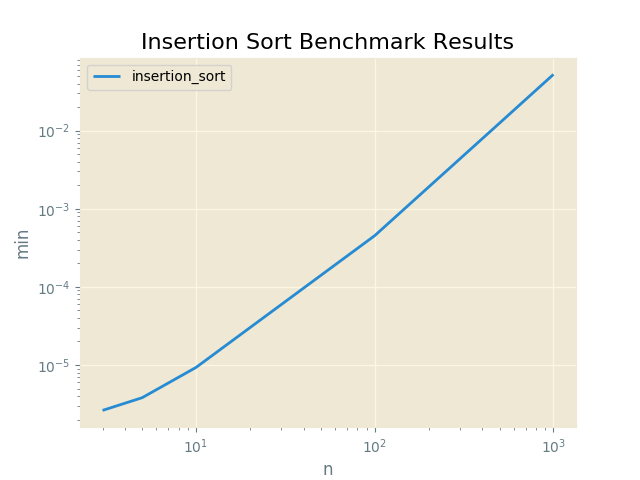

#Insertion Sort Benchmark Results

Proofs
------

|  Input               |  Output              |  Script          |  User     |
|----------------------|----------------------|------------------|-----------|
|  [6, 3, 1, 2, 5, 4]  |  [1, 2, 3, 4, 5, 6]  |  insertion_sort  |  sarcoma  |

Plots
-----

Insertion Sort Benchmark Results
----------

N = 3
------

|  min          |  avg          |  max          |  func            |  name     |
|---------------|---------------|---------------|------------------|-----------|
|  0.000002623  |  0.000003183  |  0.000010252  |  insertion_sort  |  sarcoma  |

N = 5
------

|  min          |  avg          |  max          |  func            |  name     |
|---------------|---------------|---------------|------------------|-----------|
|  0.000003815  |  0.000004206  |  0.000016928  |  insertion_sort  |  sarcoma  |

N = 10
------

|  min          |  avg          |  max          |  func            |  name     |
|---------------|---------------|---------------|------------------|-----------|
|  0.000009298  |  0.000010219  |  0.000023365  |  insertion_sort  |  sarcoma  |

N = 100
------

|  min          |  avg          |  max          |  func            |  name     |
|---------------|---------------|---------------|------------------|-----------|
|  0.000452280  |  0.000502548  |  0.000628471  |  insertion_sort  |  sarcoma  |

N = 500
------

|  min          |  avg          |  max          |  func            |  name     |
|---------------|---------------|---------------|------------------|-----------|
|  0.012498140  |  0.013104291  |  0.017318726  |  insertion_sort  |  sarcoma  |

N = 1000
------

|  min          |  avg          |  max          |  func            |  name     |
|---------------|---------------|---------------|------------------|-----------|
|  0.052352905  |  0.054518812  |  0.069892883  |  insertion_sort  |  sarcoma  |

