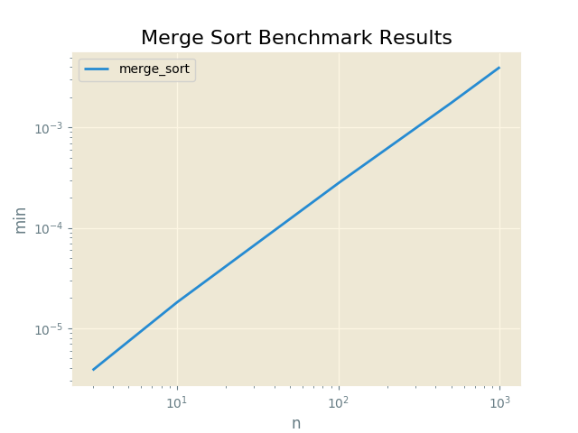

#Merge Sort Benchmark Results

Proofs
------

|  Input               |  Output              |  Script      |  User     |
|----------------------|----------------------|--------------|-----------|
|  [6, 3, 1, 2, 5, 4]  |  [1, 2, 3, 4, 5, 6]  |  merge_sort  |  sarcoma  |

Plots
-----

Merge Sort Benchmark Results
----------

N = 3
------

|  min          |  avg          |  max          |  func        |  name     |
|---------------|---------------|---------------|--------------|-----------|
|  0.000003815  |  0.000004098  |  0.000007153  |  merge_sort  |  sarcoma  |

N = 5
------

|  min          |  avg          |  max          |  func        |  name     |
|---------------|---------------|---------------|--------------|-----------|
|  0.000007391  |  0.000007868  |  0.000015259  |  merge_sort  |  sarcoma  |

N = 10
------

|  min          |  avg          |  max          |  func        |  name     |
|---------------|---------------|---------------|--------------|-----------|
|  0.000018120  |  0.000018926  |  0.000027657  |  merge_sort  |  sarcoma  |

N = 100
------

|  min          |  avg          |  max          |  func        |  name     |
|---------------|---------------|---------------|--------------|-----------|
|  0.000279188  |  0.000301611  |  0.000376225  |  merge_sort  |  sarcoma  |

N = 500
------

|  min          |  avg          |  max          |  func        |  name     |
|---------------|---------------|---------------|--------------|-----------|
|  0.001761913  |  0.001868372  |  0.002050161  |  merge_sort  |  sarcoma  |

N = 1000
------

|  min          |  avg          |  max          |  func        |  name     |
|---------------|---------------|---------------|--------------|-----------|
|  0.004000187  |  0.004105458  |  0.004303694  |  merge_sort  |  sarcoma  |

