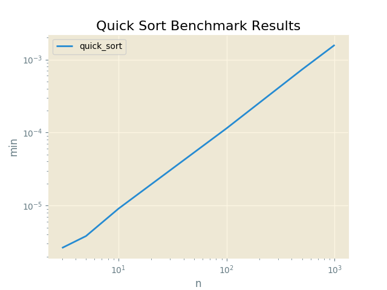

#Quick Sort Benchmark Results

Proofs
------

|  Input               |  Output              |  Script      |  User     |
|----------------------|----------------------|--------------|-----------|
|  [6, 3, 1, 2, 5, 4]  |  [1, 2, 3, 4, 5, 6]  |  quick_sort  |  sarcoma  |

Plots
-----

Quick Sort Benchmark Results
----------

N = 3
------

|  min          |  avg          |  max          |  func        |  name     |
|---------------|---------------|---------------|--------------|-----------|
|  0.000002623  |  0.000003169  |  0.000006914  |  quick_sort  |  sarcoma  |

N = 5
------

|  min          |  avg          |  max          |  func        |  name     |
|---------------|---------------|---------------|--------------|-----------|
|  0.000003815  |  0.000004344  |  0.000011683  |  quick_sort  |  sarcoma  |

N = 10
------

|  min          |  avg          |  max          |  func        |  name     |
|---------------|---------------|---------------|--------------|-----------|
|  0.000009060  |  0.000009565  |  0.000011921  |  quick_sort  |  sarcoma  |

N = 100
------

|  min          |  avg          |  max          |  func        |  name     |
|---------------|---------------|---------------|--------------|-----------|
|  0.000114202  |  0.000119655  |  0.000194311  |  quick_sort  |  sarcoma  |

N = 500
------

|  min          |  avg          |  max          |  func        |  name     |
|---------------|---------------|---------------|--------------|-----------|
|  0.000731468  |  0.000799444  |  0.001219749  |  quick_sort  |  sarcoma  |

N = 1000
------

|  min          |  avg          |  max          |  func        |  name     |
|---------------|---------------|---------------|--------------|-----------|
|  0.001583576  |  0.001701939  |  0.002541065  |  quick_sort  |  sarcoma  |

