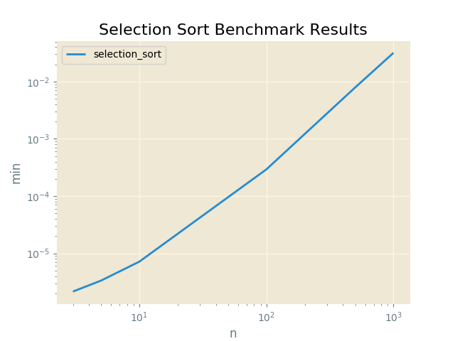

#Selection Sort Benchmark Results

Proofs
------

|  Input               |  Output              |  Script          |  User     |
|----------------------|----------------------|------------------|-----------|
|  [6, 3, 1, 2, 5, 4]  |  [1, 2, 3, 4, 5, 6]  |  selection_sort  |  sarcoma  |

Plots
-----

Selection Sort Benchmark Results
----------

N = 3
------

|  min          |  avg          |  max          |  func            |  name     |
|---------------|---------------|---------------|------------------|-----------|
|  0.000002146  |  0.000002534  |  0.000004768  |  selection_sort  |  sarcoma  |

N = 5
------

|  min          |  avg          |  max          |  func            |  name     |
|---------------|---------------|---------------|------------------|-----------|
|  0.000003338  |  0.000003948  |  0.000029325  |  selection_sort  |  sarcoma  |

N = 10
------

|  min          |  avg          |  max          |  func            |  name     |
|---------------|---------------|---------------|------------------|-----------|
|  0.000007153  |  0.000008755  |  0.000028849  |  selection_sort  |  sarcoma  |

N = 100
------

|  min          |  avg          |  max          |  func            |  name     |
|---------------|---------------|---------------|------------------|-----------|
|  0.000293016  |  0.000327892  |  0.000468731  |  selection_sort  |  sarcoma  |

N = 500
------

|  min          |  avg          |  max          |  func            |  name     |
|---------------|---------------|---------------|------------------|-----------|
|  0.007925987  |  0.008187232  |  0.009024620  |  selection_sort  |  sarcoma  |

N = 1000
------

|  min          |  avg          |  max          |  func            |  name     |
|---------------|---------------|---------------|------------------|-----------|
|  0.031814337  |  0.032412148  |  0.033735752  |  selection_sort  |  sarcoma  |

