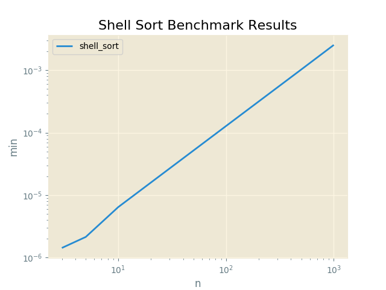

#Shell Sort Benchmark Results

Proofs
------

|  Input               |  Output              |  Script      |  User     |
|----------------------|----------------------|--------------|-----------|
|  [6, 3, 1, 2, 5, 4]  |  [1, 2, 3, 4, 5, 6]  |  shell_sort  |  sarcoma  |

Plots
-----

Shell Sort Benchmark Results
----------

N = 3
------

|  min          |  avg          |  max          |  func        |  name     |
|---------------|---------------|---------------|--------------|-----------|
|  0.000001431  |  0.000001655  |  0.000003815  |  shell_sort  |  sarcoma  |

N = 5
------

|  min          |  avg          |  max          |  func        |  name     |
|---------------|---------------|---------------|--------------|-----------|
|  0.000002146  |  0.000002410  |  0.000003576  |  shell_sort  |  sarcoma  |

N = 10
------

|  min          |  avg          |  max          |  func        |  name     |
|---------------|---------------|---------------|--------------|-----------|
|  0.000006437  |  0.000007308  |  0.000013351  |  shell_sort  |  sarcoma  |

N = 100
------

|  min          |  avg          |  max          |  func        |  name     |
|---------------|---------------|---------------|--------------|-----------|
|  0.000127554  |  0.000131805  |  0.000199318  |  shell_sort  |  sarcoma  |

N = 500
------

|  min          |  avg          |  max          |  func        |  name     |
|---------------|---------------|---------------|--------------|-----------|
|  0.001026154  |  0.001101096  |  0.001565218  |  shell_sort  |  sarcoma  |

N = 1000
------

|  min          |  avg          |  max          |  func        |  name     |
|---------------|---------------|---------------|--------------|-----------|
|  0.002528906  |  0.002671454  |  0.002850294  |  shell_sort  |  sarcoma  |

