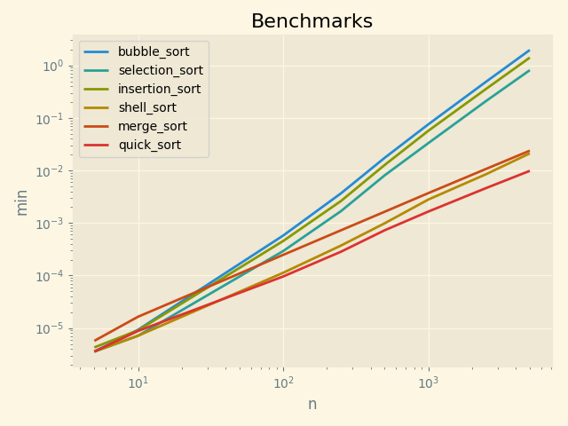

Proofs
------
Plots
-----

|  Input               |  Output              |  Script          |  User     |
|----------------------|----------------------|------------------|-----------|
|  [6, 3, 1, 2, 5, 4]  |  [1, 2, 3, 4, 5, 6]  |  bubble_sort     |  sarcoma  |
|  [6, 3, 1, 2, 5, 4]  |  [1, 2, 3, 4, 5, 6]  |  selection_sort  |  sarcoma  |
|  [6, 3, 1, 2, 5, 4]  |  [1, 2, 3, 4, 5, 6]  |  insertion_sort  |  sarcoma  |
|  [6, 3, 1, 2, 5, 4]  |  [1, 2, 3, 4, 5, 6]  |  shell_sort      |  sarcoma  |
|  [6, 3, 1, 2, 5, 4]  |  [1, 2, 3, 4, 5, 6]  |  merge_sort      |  sarcoma  |
|  [6, 3, 1, 2, 5, 4]  |  [1, 2, 3, 4, 5, 6]  |  quick_sort      |  sarcoma  |

Benchmarks
----------

N = 5
------
|  min          |  avg          |  max          |  func            |  name     |
|---------------|---------------|---------------|------------------|-----------|
|  0.000003576  |  0.000004103  |  0.000009537  |  bubble_sort     |  sarcoma  |
|  0.000003576  |  0.000004141  |  0.000011206  |  selection_sort  |  sarcoma  |
|  0.000003576  |  0.000003943  |  0.000009298  |  shell_sort      |  sarcoma  |
|  0.000003576  |  0.000004117  |  0.000008345  |  quick_sort      |  sarcoma  |
|  0.000004292  |  0.000005064  |  0.000019312  |  insertion_sort  |  sarcoma  |
|  0.000005722  |  0.000006604  |  0.000013590  |  merge_sort      |  sarcoma  |

N = 10
------
|  min          |  avg          |  max          |  func            |  name     |
|---------------|---------------|---------------|------------------|-----------|
|  0.000007153  |  0.000007823  |  0.000020504  |  selection_sort  |  sarcoma  |
|  0.000007153  |  0.000007427  |  0.000013351  |  shell_sort      |  sarcoma  |
|  0.000008821  |  0.000010521  |  0.000030994  |  quick_sort      |  sarcoma  |
|  0.000009060  |  0.000009322  |  0.000011683  |  insertion_sort  |  sarcoma  |
|  0.000009298  |  0.000009723  |  0.000012159  |  bubble_sort     |  sarcoma  |
|  0.000016451  |  0.000017233  |  0.000031948  |  merge_sort      |  sarcoma  |

N = 100
------
|  min          |  avg          |  max          |  func            |  name     |
|---------------|---------------|---------------|------------------|-----------|
|  0.000096083  |  0.000110893  |  0.000229597  |  quick_sort      |  sarcoma  |
|  0.000113010  |  0.000147500  |  0.000343084  |  shell_sort      |  sarcoma  |
|  0.000247717  |  0.000283439  |  0.000518322  |  merge_sort      |  sarcoma  |
|  0.000293016  |  0.000321927  |  0.000628233  |  selection_sort  |  sarcoma  |
|  0.000455379  |  0.000508015  |  0.001214981  |  insertion_sort  |  sarcoma  |
|  0.000577927  |  0.000678136  |  0.001496792  |  bubble_sort     |  sarcoma  |

N = 250
------
|  min          |  avg          |  max          |  func            |  name     |
|---------------|---------------|---------------|------------------|-----------|
|  0.000284433  |  0.000310559  |  0.000422955  |  quick_sort      |  sarcoma  |
|  0.000372171  |  0.000401480  |  0.000695467  |  shell_sort      |  sarcoma  |
|  0.000727177  |  0.000812888  |  0.001745939  |  merge_sort      |  sarcoma  |
|  0.001682758  |  0.001862216  |  0.003645420  |  selection_sort  |  sarcoma  |
|  0.002623081  |  0.002893932  |  0.005204201  |  insertion_sort  |  sarcoma  |
|  0.003669739  |  0.004183815  |  0.007605314  |  bubble_sort     |  sarcoma  |

N = 500
------
|  min          |  avg          |  max          |  func            |  name     |
|---------------|---------------|---------------|------------------|-----------|
|  0.000727415  |  0.000795557  |  0.001530886  |  quick_sort      |  sarcoma  |
|  0.000988007  |  0.001101823  |  0.003068924  |  shell_sort      |  sarcoma  |
|  0.001639366  |  0.001793995  |  0.003497362  |  merge_sort      |  sarcoma  |
|  0.008079767  |  0.008565502  |  0.011845827  |  selection_sort  |  sarcoma  |
|  0.012724161  |  0.013746006  |  0.029786825  |  insertion_sort  |  sarcoma  |
|  0.017404556  |  0.018285573  |  0.021609306  |  bubble_sort     |  sarcoma  |

N = 1000
------
|  min          |  avg          |  max          |  func            |  name     |
|---------------|---------------|---------------|------------------|-----------|
|  0.001653671  |  0.001815660  |  0.002951622  |  quick_sort      |  sarcoma  |
|  0.002799988  |  0.003034186  |  0.004768133  |  shell_sort      |  sarcoma  |
|  0.003709555  |  0.004029427  |  0.005839586  |  merge_sort      |  sarcoma  |
|  0.033192635  |  0.034979131  |  0.057141542  |  selection_sort  |  sarcoma  |
|  0.057005167  |  0.061409535  |  0.102965593  |  insertion_sort  |  sarcoma  |
|  0.075636148  |  0.077872810  |  0.080918550  |  bubble_sort     |  sarcoma  |

N = 2500
------
|  min          |  avg          |  max          |  func            |  name     |
|---------------|---------------|---------------|------------------|-----------|
|  0.004628658  |  0.004967868  |  0.007510662  |  quick_sort      |  sarcoma  |
|  0.008503675  |  0.009218075  |  0.016975641  |  shell_sort      |  sarcoma  |
|  0.010716438  |  0.011305294  |  0.014134407  |  merge_sort      |  sarcoma  |
|  0.210466862  |  0.216927304  |  0.240232706  |  selection_sort  |  sarcoma  |
|  0.357549906  |  0.372558253  |  0.412351608  |  insertion_sort  |  sarcoma  |
|  0.489807606  |  0.511870911  |  0.555633545  |  bubble_sort     |  sarcoma  |

N = 5000
------
|  min          |  avg          |  max          |  func            |  name     |
|---------------|---------------|---------------|------------------|-----------|
|  0.009842157  |  0.010096753  |  0.010509253  |  quick_sort      |  sarcoma  |
|  0.021173954  |  0.021856921  |  0.022891521  |  shell_sort      |  sarcoma  |
|  0.023827076  |  0.024255085  |  0.025154114  |  merge_sort      |  sarcoma  |
|  0.811820507  |  0.826733491  |  0.841341972  |  selection_sort  |  sarcoma  |
|  1.408185720  |  1.462293246  |  1.488383055  |  insertion_sort  |  sarcoma  |
|  1.964846373  |  2.379418344  |  4.289697647  |  bubble_sort     |  sarcoma  |
