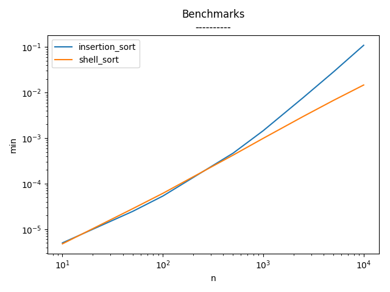

Proofs
------
[1, 2, 3, 4, 5, 6] insertion_sort sarcoma  
[1, 2, 3, 4, 5, 6] shell_sort sarcoma

Benchmarks
----------
N = 10
------
|  min          |  avg          |  max          |  func            |  name     |
|---------------|---------------|---------------|------------------|-----------|
|  0.000004768  |  0.000005577  |  0.000013828  |  shell_sort      |  sarcoma  |
|  0.000005007  |  0.000005438  |  0.000018358  |  insertion_sort  |  sarcoma  |

N = 50
------
|  min          |  avg          |  max          |  func            |  name     |
|---------------|---------------|---------------|------------------|-----------|
|  0.000024557  |  0.000026422  |  0.000150681  |  insertion_sort  |  sarcoma  |
|  0.000028133  |  0.000029719  |  0.000059605  |  shell_sort      |  sarcoma  |

N = 100
------
|  min          |  avg          |  max          |  func            |  name     |
|---------------|---------------|---------------|------------------|-----------|
|  0.000053406  |  0.000058713  |  0.000476599  |  insertion_sort  |  sarcoma  |
|  0.000061274  |  0.000062625  |  0.000095844  |  shell_sort      |  sarcoma  |

N = 500
------
|  min          |  avg          |  max          |  func            |  name     |
|---------------|---------------|---------------|------------------|-----------|
|  0.000422001  |  0.000455868  |  0.000571728  |  shell_sort      |  sarcoma  |
|  0.000465631  |  0.000616467  |  0.012568474  |  insertion_sort  |  sarcoma  |

N = 1000
------
|  min          |  avg          |  max          |  func            |  name     |
|---------------|---------------|---------------|------------------|-----------|
|  0.000988722  |  0.001091537  |  0.002143383  |  shell_sort      |  sarcoma  |
|  0.001455784  |  0.002101719  |  0.052255869  |  insertion_sort  |  sarcoma  |

N = 2500
------
|  min          |  avg          |  max          |  func            |  name     |
|---------------|---------------|---------------|------------------|-----------|
|  0.002985001  |  0.003079517  |  0.003258705  |  shell_sort      |  sarcoma  |
|  0.007749081  |  0.011557310  |  0.346490383  |  insertion_sort  |  sarcoma  |

N = 5000
------
|  min          |  avg          |  max          |  func            |  name     |
|---------------|---------------|---------------|------------------|-----------|
|  0.006718874  |  0.006867020  |  0.007343531  |  shell_sort      |  sarcoma  |
|  0.028332710  |  0.041625664  |  1.323383808  |  insertion_sort  |  sarcoma  |

N = 10000
------
|  min          |  avg          |  max          |  func            |  name     |
|---------------|---------------|---------------|------------------|-----------|
|  0.014636755  |  0.014819067  |  0.015161276  |  shell_sort      |  sarcoma  |
|  0.108971596  |  0.162148020  |  5.331435442  |  insertion_sort  |  sarcoma  |
