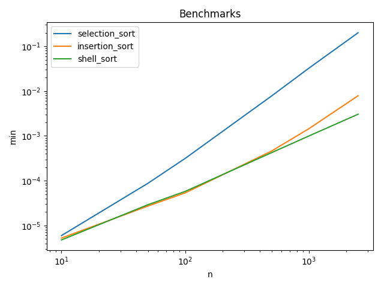

Proofs
------
|  Input               |  Output              |  Script          |  User     |
|----------------------|----------------------|------------------|-----------|
|  [6, 3, 1, 2, 5, 4]  |  [1, 2, 3, 4, 5, 6]  |  selection_sort  |  sarcoma  |
|  [6, 3, 1, 2, 5, 4]  |  [1, 2, 3, 4, 5, 6]  |  insertion_sort  |  sarcoma  |
|  [6, 3, 1, 2, 5, 4]  |  [1, 2, 3, 4, 5, 6]  |  shell_sort      |  sarcoma  |

Plot
----

Benchmarks
----------

N = 10
------
|  min          |  avg          |  max          |  func            |  name     |
|---------------|---------------|---------------|------------------|-----------|
|  0.000005245  |  0.000005476  |  0.000006914  |  insertion_sort  |  sarcoma  |
|  0.000005245  |  0.000005701  |  0.000018120  |  shell_sort      |  sarcoma  |
|  0.000005960  |  0.000006473  |  0.000011683  |  selection_sort  |  sarcoma  |

N = 50
------
|  min          |  avg          |  max          |  func            |  name     |
|---------------|---------------|---------------|------------------|-----------|
|  0.000025511  |  0.000025902  |  0.000032902  |  insertion_sort  |  sarcoma  |
|  0.000029087  |  0.000029533  |  0.000040770  |  shell_sort      |  sarcoma  |
|  0.000087500  |  0.000090308  |  0.000140429  |  selection_sort  |  sarcoma  |

N = 100
------
|  min          |  avg          |  max          |  func            |  name     |
|---------------|---------------|---------------|------------------|-----------|
|  0.000046730  |  0.000048876  |  0.000078440  |  insertion_sort  |  sarcoma  |
|  0.000056744  |  0.000060437  |  0.000115633  |  shell_sort      |  sarcoma  |
|  0.000294209  |  0.000322647  |  0.000482321  |  selection_sort  |  sarcoma  |

N = 500
------
|  min          |  avg          |  max          |  func            |  name     |
|---------------|---------------|---------------|------------------|-----------|
|  0.000431538  |  0.000456047  |  0.000565529  |  shell_sort      |  sarcoma  |
|  0.000464916  |  0.000497224  |  0.000648975  |  insertion_sort  |  sarcoma  |
|  0.007962704  |  0.008335862  |  0.013140917  |  selection_sort  |  sarcoma  |

N = 1000
------
|  min          |  avg          |  max          |  func            |  name     |
|---------------|---------------|---------------|------------------|-----------|
|  0.001006842  |  0.001058760  |  0.001222849  |  shell_sort      |  sarcoma  |
|  0.001463890  |  0.001522036  |  0.001635075  |  insertion_sort  |  sarcoma  |
|  0.032132149  |  0.032556100  |  0.037361145  |  selection_sort  |  sarcoma  |

N = 2500
------
|  min          |  avg          |  max          |  func            |  name     |
|---------------|---------------|---------------|------------------|-----------|
|  0.003020763  |  0.003181493  |  0.003371716  |  shell_sort      |  sarcoma  |
|  0.007767916  |  0.007960534  |  0.008136988  |  insertion_sort  |  sarcoma  |
|  0.202460766  |  0.209702542  |  0.294028521  |  selection_sort  |  sarcoma  |

N = 5000
------
|  min          |  avg          |  max          |  func            |  name     |
|---------------|---------------|---------------|------------------|-----------|
|  0.006912231  |  0.007103693  |  0.007475853  |  shell_sort      |  sarcoma  |
|  0.029220343  |  0.029722197  |  0.030239820  |  insertion_sort  |  sarcoma  |
|  0.810655594  |  0.819665184  |  0.860674620  |  selection_sort  |  sarcoma  |
