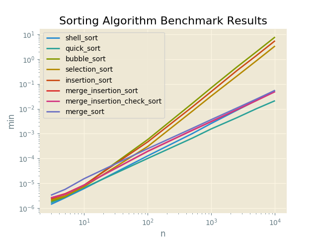

#Sorting Algorithm Benchmark Results

Proofs
------

|  Input               |  Output              |  Script                      |  User     |
|----------------------|----------------------|------------------------------|-----------|
|  [6, 3, 1, 2, 5, 4]  |  [1, 2, 3, 4, 5, 6]  |  bubble_sort                 |  sarcoma  |
|  [6, 3, 1, 2, 5, 4]  |  [1, 2, 3, 4, 5, 6]  |  selection_sort              |  sarcoma  |
|  [6, 3, 1, 2, 5, 4]  |  [1, 2, 3, 4, 5, 6]  |  insertion_sort              |  sarcoma  |
|  [6, 3, 1, 2, 5, 4]  |  [1, 2, 3, 4, 5, 6]  |  shell_sort                  |  sarcoma  |
|  [6, 3, 1, 2, 5, 4]  |  [1, 2, 3, 4, 5, 6]  |  merge_sort                  |  sarcoma  |
|  [6, 3, 1, 2, 5, 4]  |  [1, 2, 3, 4, 5, 6]  |  merge_insertion_sort        |  sarcoma  |
|  [6, 3, 1, 2, 5, 4]  |  [1, 2, 3, 4, 5, 6]  |  merge_insertion_check_sort  |  sarcoma  |
|  [6, 3, 1, 2, 5, 4]  |  [1, 2, 3, 4, 5, 6]  |  quick_sort                  |  sarcoma  |

Plots
-----

Sorting Algorithm Benchmark Results
----------

N = 3
------

|  min          |  avg          |  max          |  func                        |  name     |
|---------------|---------------|---------------|------------------------------|-----------|
|  0.000001431  |  0.000001957  |  0.000014782  |  shell_sort                  |  sarcoma  |
|  0.000001669  |  0.000002110  |  0.000009775  |  quick_sort                  |  sarcoma  |
|  0.000001907  |  0.000002182  |  0.000004530  |  bubble_sort                 |  sarcoma  |
|  0.000002146  |  0.000002434  |  0.000004053  |  selection_sort              |  sarcoma  |
|  0.000002384  |  0.000002854  |  0.000004530  |  insertion_sort              |  sarcoma  |
|  0.000002623  |  0.000003035  |  0.000004292  |  merge_insertion_sort        |  sarcoma  |
|  0.000002623  |  0.000003033  |  0.000003338  |  merge_insertion_check_sort  |  sarcoma  |
|  0.000003338  |  0.000003691  |  0.000006914  |  merge_sort                  |  sarcoma  |

N = 5
------

|  min          |  avg          |  max          |  func                        |  name     |
|---------------|---------------|---------------|------------------------------|-----------|
|  0.000002623  |  0.000003018  |  0.000005722  |  shell_sort                  |  sarcoma  |
|  0.000002861  |  0.000003366  |  0.000005484  |  bubble_sort                 |  sarcoma  |
|  0.000002861  |  0.000003273  |  0.000006199  |  quick_sort                  |  sarcoma  |
|  0.000003099  |  0.000003760  |  0.000010490  |  selection_sort              |  sarcoma  |
|  0.000003576  |  0.000003743  |  0.000005484  |  insertion_sort              |  sarcoma  |
|  0.000003576  |  0.000004015  |  0.000006914  |  merge_insertion_check_sort  |  sarcoma  |
|  0.000003815  |  0.000004086  |  0.000016928  |  merge_insertion_sort        |  sarcoma  |
|  0.000005722  |  0.000006306  |  0.000010490  |  merge_sort                  |  sarcoma  |

N = 10
------

|  min          |  avg          |  max          |  func                        |  name     |
|---------------|---------------|---------------|------------------------------|-----------|
|  0.000006199  |  0.000006495  |  0.000009537  |  shell_sort                  |  sarcoma  |
|  0.000006676  |  0.000007224  |  0.000013590  |  quick_sort                  |  sarcoma  |
|  0.000007391  |  0.000007570  |  0.000010967  |  selection_sort              |  sarcoma  |
|  0.000008345  |  0.000009017  |  0.000021935  |  bubble_sort                 |  sarcoma  |
|  0.000008583  |  0.000008938  |  0.000010967  |  insertion_sort              |  sarcoma  |
|  0.000008583  |  0.000009367  |  0.000021458  |  merge_insertion_sort        |  sarcoma  |
|  0.000008583  |  0.000009191  |  0.000017881  |  merge_insertion_check_sort  |  sarcoma  |
|  0.000015497  |  0.000016561  |  0.000035048  |  merge_sort                  |  sarcoma  |

N = 100
------

|  min          |  avg          |  max          |  func                        |  name     |
|---------------|---------------|---------------|------------------------------|-----------|
|  0.000101328  |  0.000107861  |  0.000167131  |  quick_sort                  |  sarcoma  |
|  0.000128508  |  0.000140774  |  0.000406265  |  shell_sort                  |  sarcoma  |
|  0.000195503  |  0.000212297  |  0.000286102  |  merge_insertion_sort        |  sarcoma  |
|  0.000196457  |  0.000212429  |  0.000303745  |  merge_insertion_check_sort  |  sarcoma  |
|  0.000250101  |  0.000272260  |  0.000360489  |  merge_sort                  |  sarcoma  |
|  0.000306368  |  0.000329299  |  0.000427246  |  selection_sort              |  sarcoma  |
|  0.000470400  |  0.000508261  |  0.000666857  |  insertion_sort              |  sarcoma  |
|  0.000583649  |  0.000645602  |  0.000810146  |  bubble_sort                 |  sarcoma  |

N = 500
------

|  min          |  avg          |  max          |  func                        |  name     |
|---------------|---------------|---------------|------------------------------|-----------|
|  0.000659466  |  0.000699079  |  0.000965118  |  quick_sort                  |  sarcoma  |
|  0.001005173  |  0.001071198  |  0.001304150  |  shell_sort                  |  sarcoma  |
|  0.001365423  |  0.001458943  |  0.001746178  |  merge_insertion_sort        |  sarcoma  |
|  0.001368046  |  0.001457105  |  0.001673222  |  merge_insertion_check_sort  |  sarcoma  |
|  0.001634121  |  0.001733756  |  0.002005577  |  merge_sort                  |  sarcoma  |
|  0.007990599  |  0.008281722  |  0.008694410  |  selection_sort              |  sarcoma  |
|  0.011875153  |  0.012260177  |  0.015305042  |  insertion_sort              |  sarcoma  |
|  0.016452074  |  0.017170999  |  0.020588636  |  bubble_sort                 |  sarcoma  |

N = 1000
------

|  min          |  avg          |  max          |  func                        |  name     |
|---------------|---------------|---------------|------------------------------|-----------|
|  0.001566648  |  0.001646795  |  0.001909256  |  quick_sort                  |  sarcoma  |
|  0.002605915  |  0.002765696  |  0.003200769  |  shell_sort                  |  sarcoma  |
|  0.003079653  |  0.003249190  |  0.005274057  |  merge_insertion_sort        |  sarcoma  |
|  0.003110409  |  0.003246021  |  0.003476143  |  merge_insertion_check_sort  |  sarcoma  |
|  0.003700972  |  0.003820024  |  0.004132986  |  merge_sort                  |  sarcoma  |
|  0.033157349  |  0.034010353  |  0.056026697  |  selection_sort              |  sarcoma  |
|  0.050005436  |  0.052743943  |  0.076886415  |  insertion_sort              |  sarcoma  |
|  0.071234226  |  0.074239602  |  0.077119112  |  bubble_sort                 |  sarcoma  |

N = 2500
------

|  min          |  avg          |  max          |  func                        |  name     |
|---------------|---------------|---------------|------------------------------|-----------|
|  0.004360676  |  0.004576221  |  0.008453608  |  quick_sort                  |  sarcoma  |
|  0.008671045  |  0.008926916  |  0.009428740  |  shell_sort                  |  sarcoma  |
|  0.009140491  |  0.009413464  |  0.009785414  |  merge_insertion_sort        |  sarcoma  |
|  0.009260416  |  0.009513001  |  0.009766102  |  merge_insertion_check_sort  |  sarcoma  |
|  0.010702372  |  0.010954413  |  0.013475418  |  merge_sort                  |  sarcoma  |
|  0.205119610  |  0.209462106  |  0.225755930  |  selection_sort              |  sarcoma  |
|  0.340801001  |  0.356897752  |  0.372287750  |  insertion_sort              |  sarcoma  |
|  0.475185633  |  0.499745891  |  0.514403343  |  bubble_sort                 |  sarcoma  |

N = 5000
------

|  min          |  avg          |  max          |  func                        |  name     |
|---------------|---------------|---------------|------------------------------|-----------|
|  0.009876013  |  0.010153601  |  0.010558844  |  quick_sort                  |  sarcoma  |
|  0.020946503  |  0.021475506  |  0.024542570  |  merge_insertion_sort        |  sarcoma  |
|  0.021167994  |  0.021542397  |  0.024176121  |  merge_insertion_check_sort  |  sarcoma  |
|  0.021318436  |  0.021979239  |  0.025017977  |  shell_sort                  |  sarcoma  |
|  0.024021149  |  0.024468758  |  0.025480747  |  merge_sort                  |  sarcoma  |
|  0.823639870  |  0.839642208  |  0.872511864  |  selection_sort              |  sarcoma  |
|  1.335033655  |  1.392476702  |  1.420029163  |  insertion_sort              |  sarcoma  |
|  1.895718575  |  2.007370532  |  2.057370424  |  bubble_sort                 |  sarcoma  |

N = 10000
------

|  min          |  avg          |  max          |  func                        |  name     |
|---------------|---------------|---------------|------------------------------|-----------|
|  0.021198273  |  0.021772189  |  0.024307728  |  quick_sort                  |  sarcoma  |
|  0.049018860  |  0.050696759  |  0.065692186  |  merge_insertion_check_sort  |  sarcoma  |
|  0.049438000  |  0.050072007  |  0.053002596  |  merge_insertion_sort        |  sarcoma  |
|  0.054790735  |  0.056559711  |  0.060705900  |  shell_sort                  |  sarcoma  |
|  0.055468082  |  0.056586108  |  0.060607910  |  merge_sort                  |  sarcoma  |
|  3.369047880  |  3.437402599  |  3.489730835  |  selection_sort              |  sarcoma  |
|  5.473222733  |  5.706358535  |  5.786095142  |  insertion_sort              |  sarcoma  |
|  7.739176512  |  8.185720866  |  8.328400850  |  bubble_sort                 |  sarcoma  |

