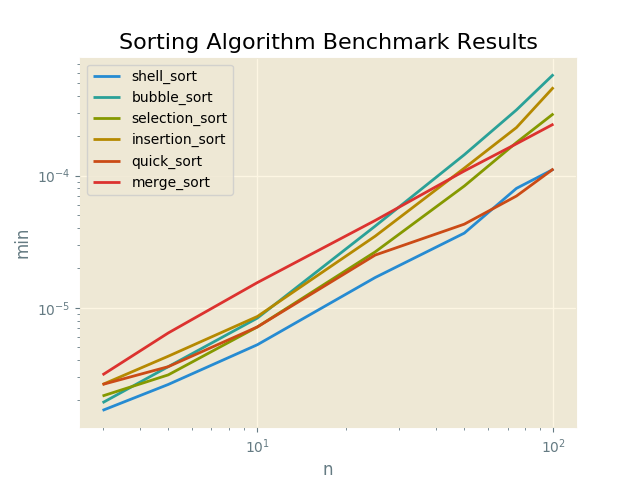

#Sorting Algorithm Benchmark Results

Proofs
------

|  Input               |  Output              |  Script          |  User     |
|----------------------|----------------------|------------------|-----------|
|  [6, 3, 1, 2, 5, 4]  |  [1, 2, 3, 4, 5, 6]  |  bubble_sort     |  sarcoma  |
|  [6, 3, 1, 2, 5, 4]  |  [1, 2, 3, 4, 5, 6]  |  selection_sort  |  sarcoma  |
|  [6, 3, 1, 2, 5, 4]  |  [1, 2, 3, 4, 5, 6]  |  insertion_sort  |  sarcoma  |
|  [6, 3, 1, 2, 5, 4]  |  [1, 2, 3, 4, 5, 6]  |  shell_sort      |  sarcoma  |
|  [6, 3, 1, 2, 5, 4]  |  [1, 2, 3, 4, 5, 6]  |  merge_sort      |  sarcoma  |
|  [6, 3, 1, 2, 5, 4]  |  [1, 2, 3, 4, 5, 6]  |  quick_sort      |  sarcoma  |

Plots
-----

Sorting Algorithm Benchmark Results
----------

N = 3
------

|  min          |  avg          |  max          |  func            |  name     |
|---------------|---------------|---------------|------------------|-----------|
|  0.000001669  |  0.000001984  |  0.000004053  |  shell_sort      |  sarcoma  |
|  0.000001907  |  0.000002332  |  0.000004530  |  bubble_sort     |  sarcoma  |
|  0.000002146  |  0.000002458  |  0.000004292  |  selection_sort  |  sarcoma  |
|  0.000002623  |  0.000002990  |  0.000005245  |  insertion_sort  |  sarcoma  |
|  0.000002623  |  0.000002975  |  0.000005722  |  quick_sort      |  sarcoma  |
|  0.000003099  |  0.000003614  |  0.000006437  |  merge_sort      |  sarcoma  |

N = 5
------

|  min          |  avg          |  max          |  func            |  name     |
|---------------|---------------|---------------|------------------|-----------|
|  0.000002623  |  0.000003426  |  0.000019550  |  shell_sort      |  sarcoma  |
|  0.000003099  |  0.000003512  |  0.000006437  |  selection_sort  |  sarcoma  |
|  0.000003576  |  0.000004032  |  0.000012159  |  bubble_sort     |  sarcoma  |
|  0.000003576  |  0.000004008  |  0.000007153  |  quick_sort      |  sarcoma  |
|  0.000004292  |  0.000004587  |  0.000006437  |  insertion_sort  |  sarcoma  |
|  0.000006437  |  0.000006971  |  0.000010490  |  merge_sort      |  sarcoma  |

N = 10
------

|  min          |  avg          |  max          |  func            |  name     |
|---------------|---------------|---------------|------------------|-----------|
|  0.000005245  |  0.000005541  |  0.000008106  |  shell_sort      |  sarcoma  |
|  0.000007153  |  0.000007422  |  0.000012636  |  selection_sort  |  sarcoma  |
|  0.000007153  |  0.000007677  |  0.000012398  |  quick_sort      |  sarcoma  |
|  0.000008345  |  0.000008810  |  0.000014305  |  bubble_sort     |  sarcoma  |
|  0.000008583  |  0.000009122  |  0.000017881  |  insertion_sort  |  sarcoma  |
|  0.000015497  |  0.000016005  |  0.000028849  |  merge_sort      |  sarcoma  |

N = 25
------

|  min          |  avg          |  max          |  func            |  name     |
|---------------|---------------|---------------|------------------|-----------|
|  0.000016928  |  0.000017726  |  0.000031233  |  shell_sort      |  sarcoma  |
|  0.000025034  |  0.000027955  |  0.000059128  |  quick_sort      |  sarcoma  |
|  0.000026464  |  0.000027449  |  0.000041962  |  selection_sort  |  sarcoma  |
|  0.000034809  |  0.000035708  |  0.000049353  |  insertion_sort  |  sarcoma  |
|  0.000041485  |  0.000044186  |  0.000061512  |  bubble_sort     |  sarcoma  |
|  0.000045776  |  0.000049534  |  0.000086069  |  merge_sort      |  sarcoma  |

N = 50
------

|  min          |  avg          |  max          |  func            |  name     |
|---------------|---------------|---------------|------------------|-----------|
|  0.000036716  |  0.000040755  |  0.000063419  |  shell_sort      |  sarcoma  |
|  0.000042915  |  0.000050364  |  0.000204802  |  quick_sort      |  sarcoma  |
|  0.000083447  |  0.000089753  |  0.000139713  |  selection_sort  |  sarcoma  |
|  0.000108480  |  0.000118437  |  0.000169516  |  merge_sort      |  sarcoma  |
|  0.000113964  |  0.000123012  |  0.000187635  |  insertion_sort  |  sarcoma  |
|  0.000144005  |  0.000155332  |  0.000217438  |  bubble_sort     |  sarcoma  |

N = 75
------

|  min          |  avg          |  max          |  func            |  name     |
|---------------|---------------|---------------|------------------|-----------|
|  0.000070095  |  0.000078402  |  0.000118017  |  quick_sort      |  sarcoma  |
|  0.000080109  |  0.000087528  |  0.000132084  |  shell_sort      |  sarcoma  |
|  0.000174284  |  0.000186720  |  0.000260115  |  merge_sort      |  sarcoma  |
|  0.000178099  |  0.000191829  |  0.000248909  |  selection_sort  |  sarcoma  |
|  0.000231266  |  0.000250020  |  0.000298500  |  insertion_sort  |  sarcoma  |
|  0.000314474  |  0.000341465  |  0.000414848  |  bubble_sort     |  sarcoma  |

N = 100
------

|  min          |  avg          |  max          |  func            |  name     |
|---------------|---------------|---------------|------------------|-----------|
|  0.000111818  |  0.000119028  |  0.000157833  |  shell_sort      |  sarcoma  |
|  0.000112534  |  0.000129914  |  0.000235081  |  quick_sort      |  sarcoma  |
|  0.000245571  |  0.000303669  |  0.000470877  |  merge_sort      |  sarcoma  |
|  0.000294447  |  0.000319669  |  0.000559807  |  selection_sort  |  sarcoma  |
|  0.000466347  |  0.000496440  |  0.000605345  |  insertion_sort  |  sarcoma  |
|  0.000584126  |  0.000643268  |  0.001145840  |  bubble_sort     |  sarcoma  |

